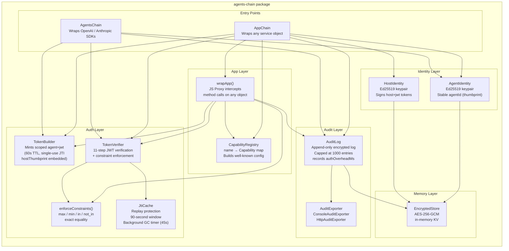
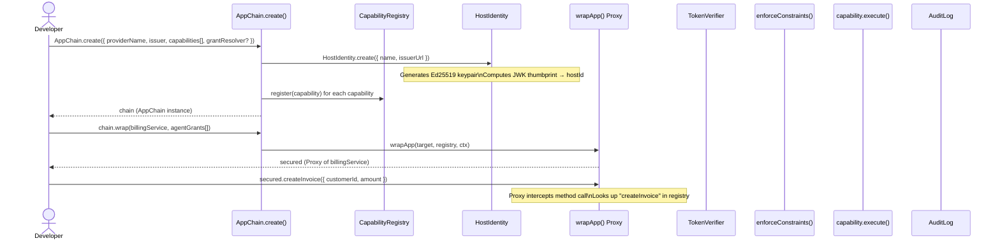
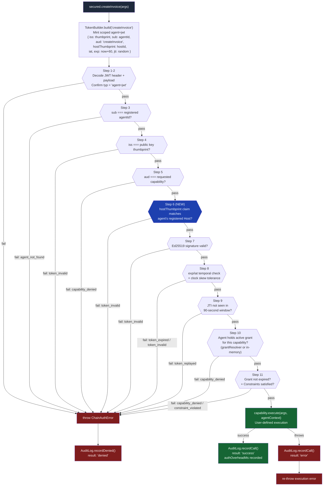
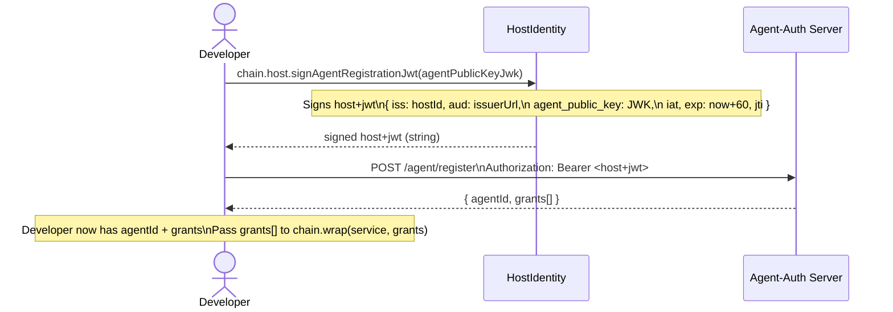
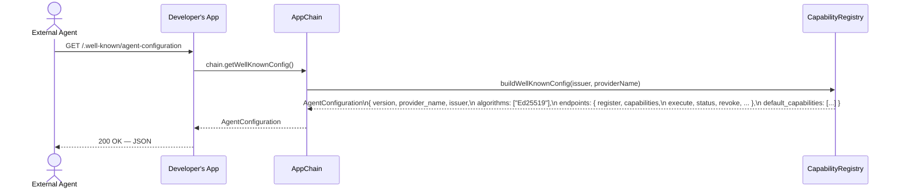
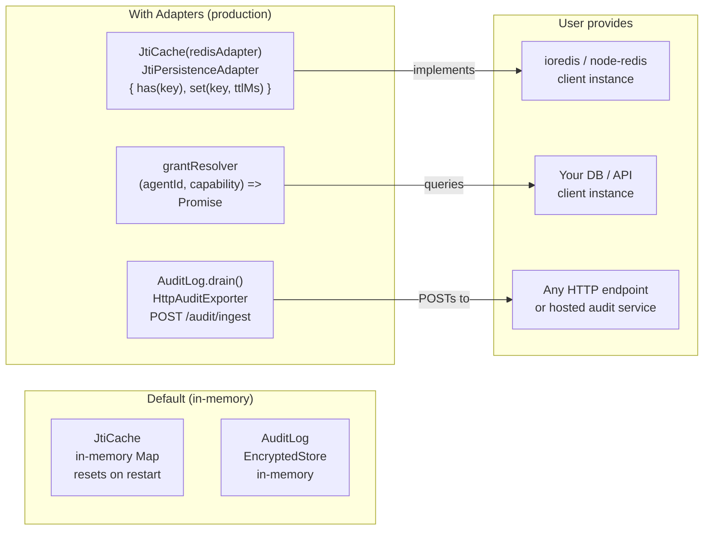

# agents-chain — Architecture

agents-chain is a **security layer** that wraps any app or service object with Ed25519-based identity, JWT-gated capability enforcement, constraint validation, and an encrypted audit trail. It has zero mandatory runtime dependencies — Redis, databases, and HTTP clients are injected by the user via adapter interfaces.

---

## Package Internals



---

## Integration Flow — Wrapping an App

This shows how a developer integrates agents-chain in front of their own service (e.g. a billing service).



---

## Per-Call Security Flow

Every intercepted capability call goes through this 11-step verification pipeline.



---

## Host → Agent Delegation Chain

Every agent is cryptographically linked to its Host. This closes the rogue-agent gap — a self-issued agent cannot impersonate a registered one because the verifier checks `hostThumbprint` at step 6.

```mermaid
flowchart LR
    subgraph HostLayer["Host Layer"]
        HI["HostIdentity\nEd25519 keypair\nhostId = JWK thumbprint"]
    end

    subgraph AgentLayer["Agent Layer"]
        AI["AgentIdentity\nEd25519 keypair\nregistration embeds:\n- hostThumbprint\n- hostPublicKeyJwk"]
    end

    subgraph TokenLayer["Token Layer (per-call)"]
        JWT["agent+jwt\nclaims include:\n- iss: agentThumbprint\n- sub: agentId\n- hostThumbprint: hostId"]
    end

    subgraph VerifyLayer["Verification (step 6)"]
        CHECK["jwt.hostThumbprint\n===\nagentIdentity.hostThumbprint?"]
    end

    HI -->|"thumbprint + publicKeyJwk\nembedded at registration"| AI
    AI -->|"hostThumbprint\nincluded in every token"| JWT
    JWT -->|"checked by TokenVerifier"| CHECK
    CHECK -->|"mismatch → token_invalid"| DENY["ChainAuthError\ntoken_invalid"]
    CHECK -->|"match → proceed"| NEXT["Steps 7-11"]

    style HI fill:#1e40af,color:#eff6ff
    style AI fill:#1e40af,color:#eff6ff
    style JWT fill:#1e293b,color:#f8fafc
    style CHECK fill:#166534,color:#f0fdf4
    style DENY fill:#7f1d1d,color:#fef2f2
```



---

## Host JWT Flow — Agent Registration

The `HostIdentity` is used to sign management JWTs when registering agents against an agent-auth compliant server.



---

## Well-Known Discovery



---

## Persistence Adapters — Plugging In Redis

agents-chain defaults to in-memory state. For production deployments, plug in your own Redis client via two adapter interfaces — the package never imports a Redis client.



---

## Complete Integration Example

```mermaid
graph TD
    subgraph YourApp["Your Application"]
        SVC["billingService\n(your existing object)"]
        ROUTES["Express Routes"]
        WK["Well-Known Endpoint\nGET /.well-known/agent-configuration"]
    end

    subgraph ChainSetup["AppChain Setup"]
        AC["AppChain.create({\n  providerName: 'billing',\n  issuer: 'https://billing.co',\n  capabilities: [...],\n  grantResolver: db.getGrant\n})"]
        SECURED["chain.wrap(billingService, grants)\n→ secured (Proxy)"]
    end

    subgraph Security["agents-chain Security Layer"]
        PROXY["JS Proxy Intercept"]
        JWT_FLOW["11-Step JWT Verification"]
        CONSTRAINT["Constraint Enforcement"]
        AUDIT["Encrypted Audit Log"]
    end

    subgraph Storage["Optional External Storage"]
        REDIS2["Redis\nJTI replay protection"]
        AUDITDB["Audit Ingest\nHttpAuditExporter"]
        GRANTDB["Grant Store\ngrantResolver callback"]
    end

    ROUTES --> SECURED
    SECURED --> PROXY
    PROXY --> JWT_FLOW
    JWT_FLOW --> CONSTRAINT
    CONSTRAINT --> SVC
    SVC --> AUDIT
    AUDIT -->|drain()| AUDITDB
    JWT_FLOW -->|JtiCache| REDIS2
    JWT_FLOW -->|grantResolver| GRANTDB
    WK --> AC

    style PROXY fill:#1e40af,color:#eff6ff
    style JWT_FLOW fill:#1e40af,color:#eff6ff
    style CONSTRAINT fill:#1e40af,color:#eff6ff
    style AUDIT fill:#1e40af,color:#eff6ff
```
