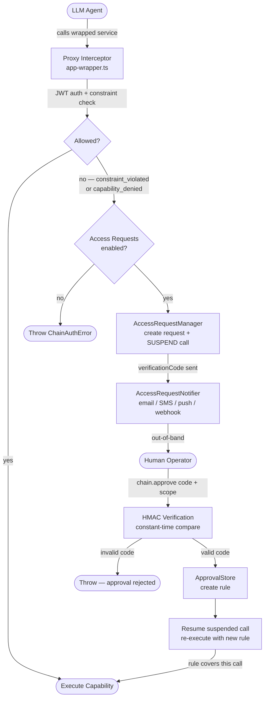
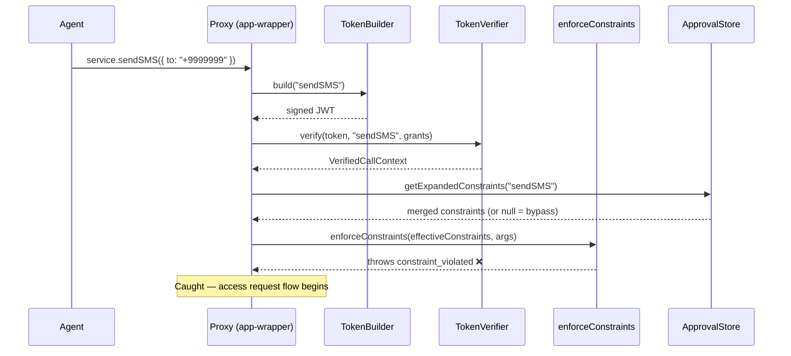
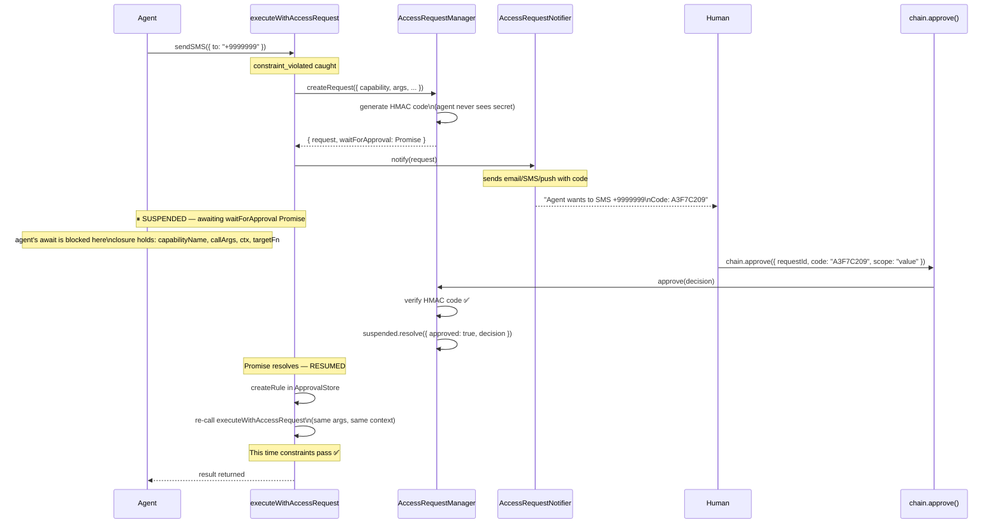
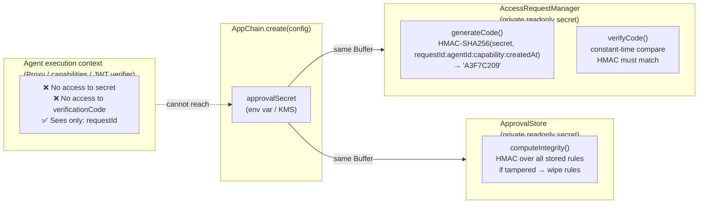
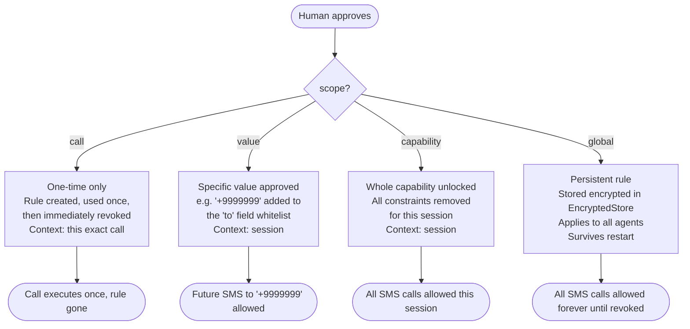
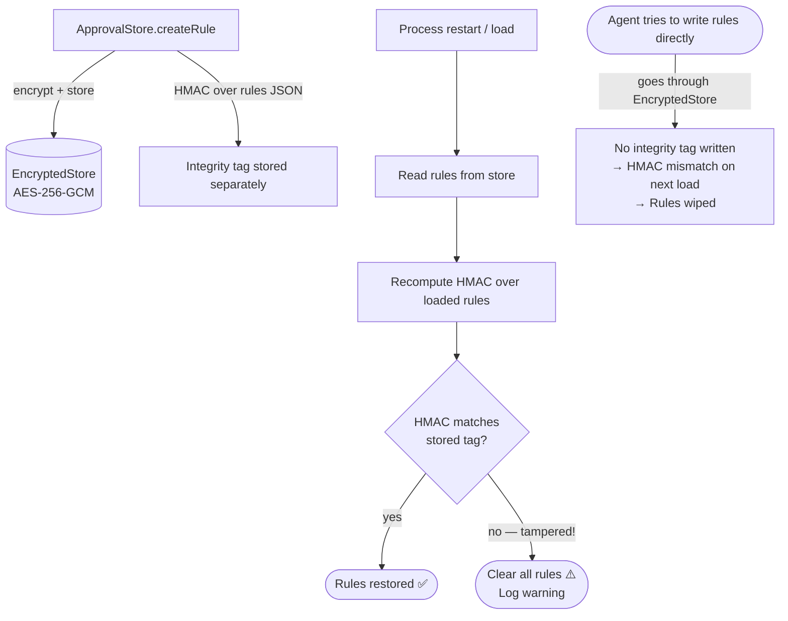

# agentchain — Access Request System Overview

This document explains how the access request layer works: how an agent's blocked call turns into a human notification, gets approved with a tamper-proof code, and resumes exactly where it left off.

---

## 1. The Big Picture



---

## 2. The Proxy Intercept — Every Call Goes Through Here

Every method call on a wrapped service object is intercepted by a `Proxy` in [app-wrapper.ts](src/app/app-wrapper.ts). This is where auth, constraints, and the access request flow all live.



---

## 3. The Suspend & Resume Flow — How Context is Preserved

This is the key mechanism. The agent's call does not throw — it **blocks** on a Promise inside `executeWithAccessRequest`. All context (capability name, args, auth context) lives in the function's closure. When the human approves, the Promise resolves and the exact same call re-runs.



---

## 4. The HMAC Security Model — Why Agents Can't Self-Approve

The verification code is a truncated HMAC-SHA256 digest. The agent has no path to the secret — it is a `private readonly Buffer` inside `AccessRequestManager`, never passed to anything the agent's execution context can reach.



**Code generation input:**
```
HMAC-SHA256(
  key: approvalSecret,
  data: "areq_abc123:agent-xyz:sendSMS:1718000000000"
) → "A3F7C209FF..."  →  truncate to 8 chars  →  "A3F7C209"
```

The code is tied to the specific `requestId + agentId + capability + timestamp`. A code from one request cannot be replayed on a different one.

---

## 5. The 4 Approval Scopes

When the human approves, they choose how broadly to grant permission.



---

## 6. ApprovalStore — Tamper-Proof Rule Storage

Rules are stored encrypted (AES-256-GCM via `EncryptedStore`). On top of that, an HMAC integrity tag covers the entire rule list. If anything modifies the store directly, the HMAC check fails on load and all rules are wiped.



---

## 7. How to Use It — API Surface

### Setup

```typescript
const chain = await AppChain.create({
  providerName: "my-service",
  issuer: "https://myapp.com",
  capabilities: [sendSMSCapability],
  accessRequests: {
    approvalSecret: process.env.APPROVAL_SECRET, // keep outside agent reach
    requestTTLMs: 5 * 60 * 1000,                // requests expire in 5 min
    notifier: {
      async notify(request) {
        // send email, SMS, push notification, webhook — your choice
        await sendEmail({
          to: "admin@myapp.com",
          subject: `Agent access request: ${request.capability}`,
          body: `Agent "${request.agentName}" wants to call ${request.capability}\n` +
                `Reason: ${request.reason}\n` +
                `Code: ${request.verificationCode}\n` +
                `Approve at: https://myapp.com/approve?id=${request.requestId}`
        });
      },
      async onResolved(request, outcome) {
        // optional: update your UI or close a notification
      }
    }
  }
});
```

### Approval Endpoint

```typescript
// POST /agent-approvals  (your API — called by human via UI or webhook)
app.post("/agent-approvals", (req, res) => {
  const { requestId, code, scope, ttl } = req.body;
  try {
    const approved = chain.approve({ requestId, code, scope, ttl });
    // The suspended agent call resumes automatically here
    res.json({ ok: true, capability: approved.capability });
  } catch (err) {
    res.status(400).json({ error: err.message });
  }
});
```

### Dashboard / Monitoring

```typescript
// See what's waiting
chain.getPendingRequests();  // AccessRequest[]

// See what's been approved
chain.getApprovalRules();    // ApprovalRule[]

// Revoke a rule
chain.revokeApproval(ruleId);
chain.revokeApprovalsForCapability("sendSMS");
chain.revokeAllApprovals();
```

---

## 8. File Map

```
src/
├── types/
│   ├── access-request.ts      ← All types: AccessRequest, ApprovalScope, ApprovalRule,
│   │                             SuspendedCall, AccessRequestNotifier, ApprovalDecision
│   └── audit.ts               ← Extended: access_requested / access_approved / access_denied
│
├── access/
│   ├── access-request-manager.ts  ← HMAC code generation, pending request tracking,
│   │                                 approve/deny/expire, suspended Promise map
│   └── approval-store.ts          ← Encrypted + HMAC-integrity rule storage,
│                                    constraint expansion and merging
│
├── app/
│   └── app-wrapper.ts         ← Proxy interceptor — suspend/resume integration,
│                                 getEffectiveConstraints, re-execute on approval
│
├── errors/
│   └── chain-error.ts         ← Added: access_request_pending / denied / expired
│
└── chain.ts                   ← AppChain: wires it all together, exposes
                                  approve() / deny() / getPendingRequests() /
                                  getApprovalRules() / revokeApproval()
```
