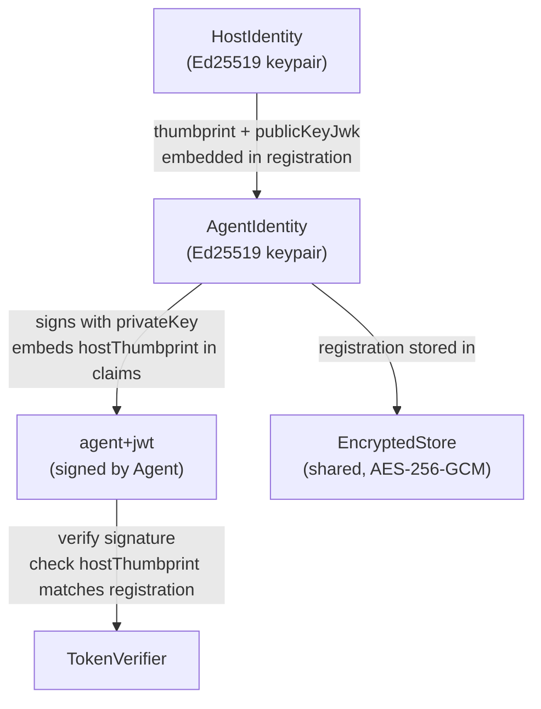
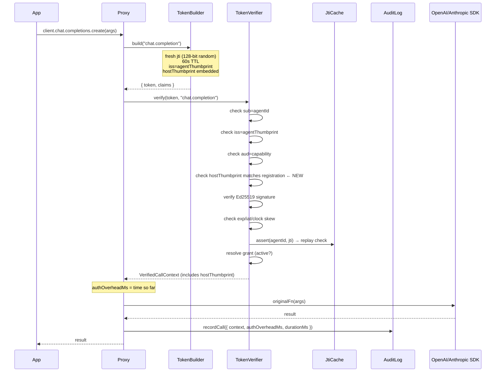
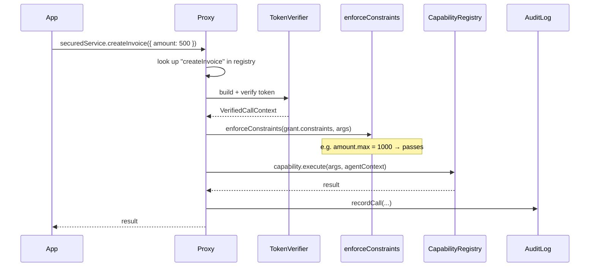
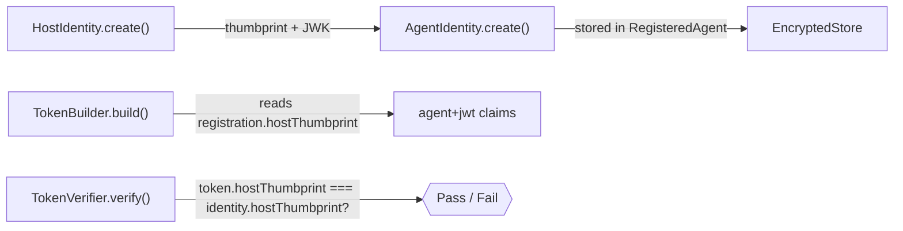
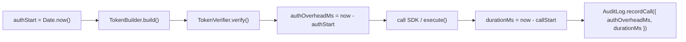
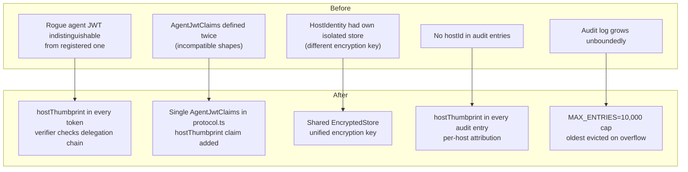

# agents-chain — Implementation Overview

## What Was Done

This document describes the changes made to align `agents-chain` with the [agent-auth protocol](https://agent-auth-protocol.com/docs/introduction), fix confirmed bugs, and improve security, correctness, and observability.

---

## Architecture

### Protocol Alignment

The agent-auth protocol defines three principals: **Host**, **Agent**, and **Server**. `agents-chain` is the client-side implementation — it does not ship a server, but it correctly implements the Host and Agent roles so that the JWTs it produces are compatible with any compliant agent-auth server.

The key insight from the protocol: **a Host is the persistent identity** of the client environment. Agents are registered *under* a Host. Every agent JWT must carry the Host thumbprint so a verifier can reconstruct the delegation chain without a server call.



---

## Call Flow

### AgentsChain (AI SDK wrapper)



### AppChain (service object wrapper)

Same pipeline, but instead of calling the original SDK method, it calls `capability.execute(args, agentContext)` — the user's own logic registered in the `CapabilityRegistry`. Constraints on call args are enforced between the JWT verification and the execute call.



---

## Fixes Applied

### 1. Host → Agent Delegation Chain (Critical Security Fix)

**Problem:** `RegisteredAgent` had no host linkage. A self-issued agent JWT was indistinguishable from a legitimately-registered one — any agent could fabricate a valid-looking token.

**Fix:**
- `RegisteredAgent` now stores `hostThumbprint` + `hostPublicKeyJwk`
- `AgentIdentity.create()` requires these fields (throws if absent)
- `TokenBuilder.build()` embeds `hostThumbprint` in every `agent+jwt` claim
- `TokenVerifier.verify()` checks the token's `hostThumbprint` matches the stored registration (step 6 of 11)
- `VerifiedCallContext` now exposes `hostThumbprint` (was `hostId?: string`)
- `AuditEntry` now records `hostThumbprint` for per-host audit attribution



### 2. `AgentJwtClaims` Type Duplication

**Problem:** Two incompatible definitions of `AgentJwtClaims` — one in `token-builder.ts` (with `hostname`, `agentName`) and one in `protocol.ts` (with `capabilities?`). The verifier imported from `token-builder.ts`; the protocol spec was dead code.

**Fix:** Single canonical definition in `types/protocol.ts`, re-exported from `token-builder.ts`. Added `hostThumbprint` claim. Removed the local definition entirely.

### 3. Constraint Type Duplication

**Problem:** `ConstraintPrimitive`, `ConstraintOperator`, `ConstraintValue` were defined identically in both `types/identity.ts` and `types/capabilities.ts`.

**Fix:** `capabilities.ts` is the canonical location. `identity.ts` re-exports them via `export type { ... } from "./capabilities.js"`.

### 4. `HostIdentity` Isolated Store

**Problem:** `HostIdentity.create()` called `EncryptedStore.create()` internally, creating a **second** isolated store separate from the chain's store. Host registration data was siloed with a different encryption key.

**Fix:** `HostIdentity.create()` now accepts a `store: EncryptedStore` parameter. Both `AgentsChain` and `AppChain` pass their shared store — all chain state (host, agent, audit log) uses one unified encrypted store.

### 5. JTI Cache "Replay Detected" Bug

**Problem:** The author noted a bug where the in-memory path "always says token Replay Detected". After analysis, the in-memory logic itself is correct. The root cause was test/integration code calling `verify()` twice on the same token (same `jti`). The wrappers always call `TokenBuilder.build()` before each verify — this generates a fresh random `jti` per call, so legitimate sequential calls never collide.

**Fix:** The logic is correct. Added detailed documentation explaining the root cause, renamed `inMemory.get(cacheKey) !== undefined` to `inMemory.has(cacheKey)` for clarity. Added clear error messages pointing developers to `TokenBuilder.build()`.

### 6. `AuditLog` Unbounded Memory Growth

**Problem:** `AuditLog` used `store.append()` which read → decrypt → push → re-encrypt the entire array on every call. No size limit — long-running processes would accumulate entries indefinitely.

**Fix:** `AuditLog` now manages its own capped array via `appendCapped()`:
- Reads the current array once per call
- If at `MAX_ENTRIES` (10,000), evicts the oldest entry before pushing
- Writes back via `store.set()` — one encrypt per call
- `drain()` flushes + clears; call it periodically or on shutdown

### 7. Missing `AgentsChain.drain()`

**Problem:** `AppChain` had `drain()` but `AgentsChain` did not, so users wrapping OpenAI/Anthropic had no way to export or clear their audit log.

**Fix:** `AgentsChain` now has `drain(exporter?)` with the same semantics as `AppChain`.

### 8. Auth Latency Measurement

**Problem:** No way to measure how much latency the security layer added to each call.

**Fix:**
- `AuditEntry` gains `authOverheadMs: number` — the milliseconds spent inside `build() + verify()` before the underlying SDK or service is called
- `ChainStats` gains `authOverhead: { avgMs, maxMs }` — aggregate across all recorded calls
- All three wrappers (openai, anthropic, app) measure and record this



### 9. Well-Known Config Spec Alignment

**Problem:** Missing `describe_capability` and `introspect` endpoints; no `description` or `jwks_uri` fields.

**Fix:** `buildWellKnownConfig()` now produces:
- All protocol-specified endpoints including `describe_capability` and `introspect`
- Optional `description` and `jwks_uri` fields (passed via `opts` parameter)
- `getWellKnownConfig()` on `AppChain` accepts `opts` and forwards them

---

## File-by-File Change Summary

| File | Change |
|---|---|
| [src/types/identity.ts](src/types/identity.ts) | Removed duplicate constraint types (re-export from capabilities.ts); added `hostThumbprint`, `hostPublicKeyJwk` to `RegisteredAgent`; added `jtiAdapter`, `auditExporter` to `AgentConfig` |
| [src/types/capabilities.ts](src/types/capabilities.ts) | Now canonical location for `ConstraintPrimitive`, `ConstraintOperator`, `ConstraintValue`, `GrantConstraints` |
| [src/types/protocol.ts](src/types/protocol.ts) | Single canonical `AgentJwtClaims` with `hostThumbprint` claim; added `description` + `jwks_uri` to `AgentConfiguration` |
| [src/types/chain.ts](src/types/chain.ts) | `ChainStats` gains `hostId` + `authOverhead`; `AppChainConfig.host` no longer references removed `HostConfig.encryptionKey` |
| [src/types/audit.ts](src/types/audit.ts) | `AuditEntry` gains `hostThumbprint` + `authOverheadMs` |
| [src/identity/agent-identity.ts](src/identity/agent-identity.ts) | `create()` requires `hostThumbprint` + `hostPublicKeyJwk`; `restore()` validates them; new `hostThumbprint` getter + `getHostPublicKey()` |
| [src/host/host-identity.ts](src/host/host-identity.ts) | Removed internal `EncryptedStore.create()` — accepts shared store as param; `signJwt()` renamed to `signHostJwt()`; `fromKeyPair()` updated similarly |
| [src/auth/token-builder.ts](src/auth/token-builder.ts) | Removed local `AgentJwtClaims` definition; imports from `protocol.ts`; embeds `hostThumbprint` in every token |
| [src/auth/token-verifier.ts](src/auth/token-verifier.ts) | Added step 6: `hostThumbprint` delegation chain check; `VerifiedCallContext.hostThumbprint` always present (no longer optional); imports `AgentJwtClaims` from `protocol.ts` |
| [src/memory/jti-cache.ts](src/memory/jti-cache.ts) | Documented root cause of "replay detected" bug; `inMemory.get !== undefined` → `inMemory.has()`; improved error messages |
| [src/memory/encrypted-store.ts](src/memory/encrypted-store.ts) | Documented that `AuditLog` bypasses `append()` for capped writes |
| [src/audit/audit-log.ts](src/audit/audit-log.ts) | `recordDenied` + `recordCall` accept `hostThumbprint` + `authOverheadMs`; capped `appendCapped()` replaces `store.append()` |
| [src/app/capability-registry.ts](src/app/capability-registry.ts) | Added `describe_capability` + `introspect` endpoints; optional `description` + `jwks_uri` in well-known config |
| [src/app/app-wrapper.ts](src/app/app-wrapper.ts) | Passes `authOverheadMs` + `hostThumbprint` to audit log; `agentContext.hostId` = `verified.hostThumbprint` |
| [src/wrappers/openai-wrapper.ts](src/wrappers/openai-wrapper.ts) | Measures `authOverheadMs`; passes `hostThumbprint` to `recordDenied` |
| [src/wrappers/anthropic-wrapper.ts](src/wrappers/anthropic-wrapper.ts) | Same as openai-wrapper |
| [src/chain.ts](src/chain.ts) | `AgentsChain.create()` creates Host first then links Agent; `AgentsChain.drain()` added; `getStats()` includes `hostId` + `authOverhead`; `AppChain.create()` uses shared store + correct host-before-agent ordering |
| [src/index.ts](src/index.ts) | Cleaned up duplicate constraint exports; added new type exports |

---

## Security Improvements Summary



---

## Usage Examples

### AgentsChain (OpenAI/Anthropic)

```typescript
import { AgentsChain, ConsoleAuditExporter } from "agents-chain";
import OpenAI from "openai";

const chain = await AgentsChain.create({
  agentName: "summarizer",
  hostname: "my-app",
  capabilities: ["chat.completion", "embedding"],
  auditExporter: new ConsoleAuditExporter(),
});

// chain.host and chain.agentId are now available
// Every token carries chain.host.thumbprint — verifiable delegation chain

const ai = chain.openai(new OpenAI({ apiKey: process.env.OPENAI_API_KEY }));
const result = await ai.chat.completions.create({ model: "gpt-4o", messages: [...] });

// Measure auth overhead
const stats = chain.getStats();
console.log(`Auth overhead: avg=${stats.authOverhead.avgMs}ms max=${stats.authOverhead.maxMs}ms`);

// Flush on shutdown
process.on("SIGTERM", () => chain.drain());
```

### AppChain (service objects)

```typescript
import { AppChain, ConsoleAuditExporter } from "agents-chain";
import type { Capability, ResolvedGrant } from "agents-chain";

const invoiceCapability: Capability<{ customerId: string; amount: number }, { invoiceId: string }> = {
  name: "createInvoice",
  description: "Create a new invoice for a customer",
  inputSchema: { type: "object", required: ["customerId", "amount"] },
  outputSchema: { type: "object", properties: { invoiceId: { type: "string" } } },
  execute: async ({ customerId, amount }, ctx) => {
    // ctx.hostId is now the Host thumbprint — traceable delegation
    return billingService.createInvoice(customerId, amount);
  },
};

const chain = await AppChain.create({
  providerName: "billing-service",
  issuer: "https://billing.mycompany.com",
  capabilities: [invoiceCapability],
});

// Serve discovery
app.get("/.well-known/agent-configuration", (req, res) =>
  res.json(chain.getWellKnownConfig("", {
    description: "Billing service — invoices and payments",
    jwks_uri: "https://billing.mycompany.com/.well-known/jwks.json",
  }))
);

// Wrap with per-agent grants (including constraints)
const grants: ResolvedGrant[] = [
  {
    capability: "createInvoice",
    status: "active",
    constraints: { amount: { max: 10000 } },
    expiresAt: Date.now() + 3600_000,
  },
];

const secured = chain.wrap(billingService, grants);
const invoice = await secured.createInvoice({ customerId: "c1", amount: 500 });
```

---

## What Is NOT Implemented (By Design)

Per the user's instructions, the following are intentionally deferred:

- **Approval flows** (device authorization, CIBA) — no polling, no verification URLs
- **Remote agent registration** (POST /agent/register) — no HTTP client
- **Server-side routes** — no Express/Hono middleware; consumers implement these themselves
- **Key persistence** — users call `host.exportPrivateKeyJwk()` and store it themselves
- **JWKS endpoint** — consumers wire this up; `getWellKnownConfig()` accepts a `jwks_uri` to point to it
