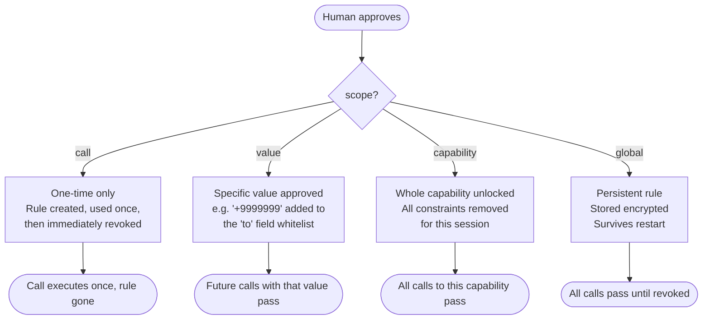

# Approval Scopes

When the human approves an access request, they choose how broadly to grant permission. This determines how long the approval lasts and what future calls it covers.

## The 4 Scopes



## Scope Details

### `call` — One-Time

Approve this exact call only. The approval rule is created, the call re-executes, and the rule is immediately revoked.

```typescript
chain.approve({ requestId, code, scope: 'call' });
```

**Use when:** You want to allow a single unusual operation without opening the door for future ones.

### `value` — Session Whitelist Expansion

Approve the specific field value that was violated. For example, if `+254799999999` was not in the `to` whitelist, approving with `scope: 'value'` adds it to the whitelist for the remainder of the session.

```typescript
chain.approve({ requestId, code, scope: 'value' });
```

**Use when:** The value is legitimate but wasn't pre-configured. Future calls with this same value won't prompt again.

### `capability` — Session Bypass

Bypass all constraints for this capability for the remainder of the session. The agent can call it with any arguments.

```typescript
chain.approve({ requestId, code, scope: 'capability' });
```

**Use when:** You trust the agent to use this capability freely for now.

### `global` — Persistent

Create a persistent rule that survives process restarts. Stored AES-256-GCM encrypted in the `ApprovalStore`. Applies to all agents.

```typescript
chain.approve({ requestId, code, scope: 'global' });
```

**Use when:** You want to permanently expand the whitelist without modifying code.

## Optional TTL

Any scope can carry a TTL (time-to-live):

```typescript
chain.approve({
  requestId,
  code,
  scope: 'value',
  ttl: { durationMs: 60 * 60 * 1000 },  // expires in 1 hour
});

// Or absolute expiry
chain.approve({
  requestId,
  code,
  scope: 'capability',
  ttl: { expiresAt: Date.now() + 24 * 60 * 60 * 1000 },  // 24h
});
```

Without TTL:
- `call` — expires immediately after use
- `value` / `capability` — expires when the session ends
- `global` — never expires (until explicitly revoked)

## Revoking Approvals

```typescript
chain.revokeApproval(ruleId);                    // specific rule
chain.revokeApprovalsForCapability('send_sms');   // all rules for a capability
chain.revokeAllApprovals();                       // everything
```
