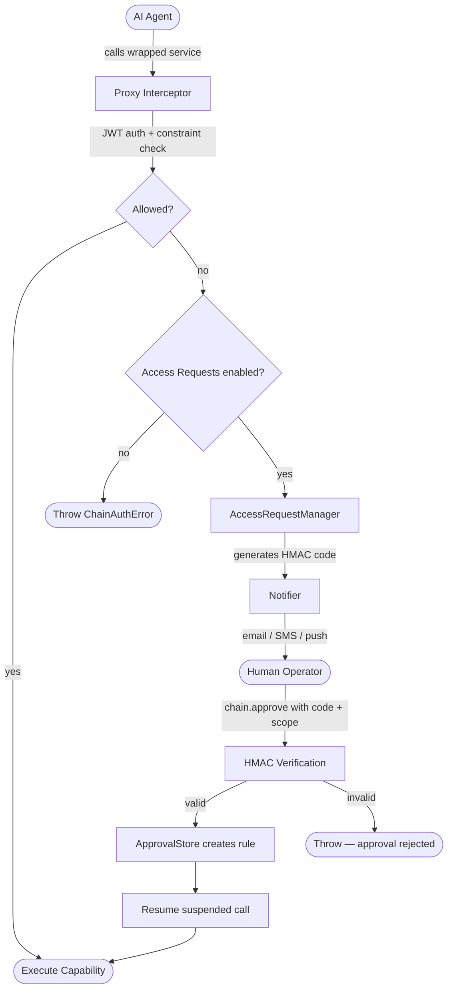
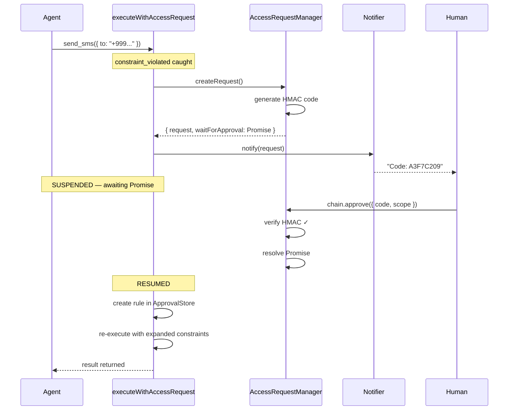

# Access Request System

When `accessRequests` is configured, denied calls don't throw immediately. Instead, the agent's call **suspends** — the Promise blocks — while a human reviews the request out-of-band. When approved, the call resumes exactly where it left off.

## The Big Picture



## Setup

```typescript
const chain = await AppChain.create({
  providerName: 'my-service',
  issuer: 'https://myservice.com',
  capabilities: [...],
  accessRequests: {
    approvalSecret: process.env.APPROVAL_SECRET,  // keep outside agent reach
    requestTTLMs: 5 * 60 * 1000,                  // 5 min to respond
    notifier: {
      async notify(request) {
        await sendEmail({
          to: 'admin@myservice.com',
          subject: `Access request: ${request.capability}`,
          body: `Agent "${request.agentName}" wants to call ${request.capability}\n` +
                `Args: ${JSON.stringify(request.args)}\n` +
                `Code: ${request.verificationCode}`,
        });
      },
      async onResolved(request, outcome) {
        // optional: update UI when resolved
      },
    },
  },
});
```

## The Suspend & Resume Flow

This is the key mechanism. The agent's call does not throw — it blocks on a Promise. All context (capability name, args, auth) lives in the closure.



## Approve / Deny API

```typescript
// Approve — the suspended call resumes
chain.approve({
  requestId: 'areq_abc123',
  code: 'A3F7C209',
  scope: 'value',       // see Approval Scopes
  ttl: { durationMs: 3600000 },  // optional
});

// Deny — the suspended call throws access_request_denied
chain.deny({
  requestId: 'areq_abc123',
  code: 'A3F7C209',
  reason: 'Not authorized for this number',  // optional
});

// Dashboard
chain.getPendingRequests();     // AccessRequest[]
chain.getApprovalRules();       // ApprovalRule[]
chain.revokeApproval(ruleId);   // revoke a specific rule
chain.revokeAllApprovals();     // wipe everything
```

## Terminal Notifier Example

For development, print access requests to the server console:

```typescript
const terminalNotifier = {
  async notify(request) {
    console.log(`\n${'='.repeat(50)}`);
    console.log(`  ACCESS REQUEST PENDING`);
    console.log(`  Capability: ${request.capability}`);
    console.log(`  Args: ${JSON.stringify(request.args)}`);
    console.log(`  Code: ${request.verificationCode}`);
    console.log(`${'='.repeat(50)}\n`);
  },
  async onResolved(request, outcome) {
    console.log(`[Access Request] ${outcome}: ${request.requestId}`);
  },
};
```
