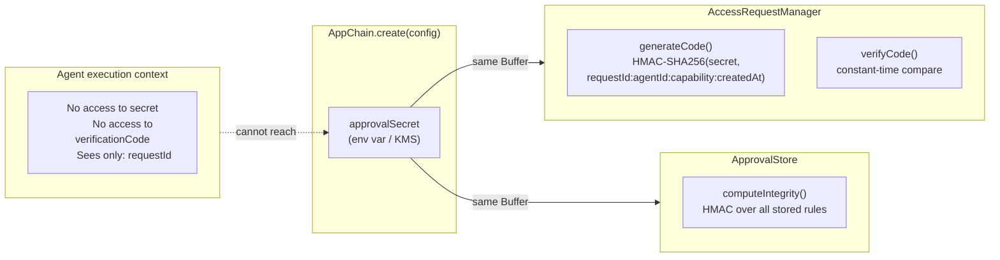
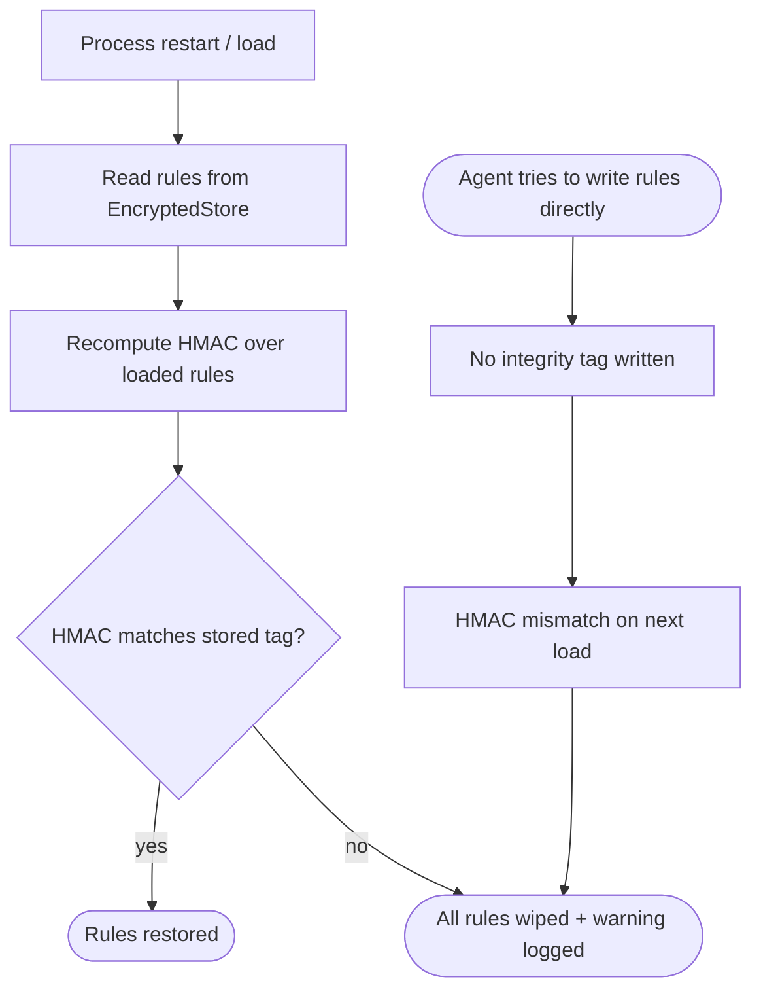

# Security Model

The access request system is designed so that **agents cannot self-approve**. The verification code, the secret, and the approval store all have integrity protections that prevent tampering.

## HMAC Verification Codes

The verification code is a truncated HMAC-SHA256 digest:

```
HMAC-SHA256(
  key:  approvalSecret,
  data: "areq_abc123:agent-xyz:sendSMS:1718000000000"
) → "A3F7C209FF..."  →  truncate to 8 chars  →  "A3F7C209"
```

The code is tied to the specific `requestId + agentId + capability + createdAt`. A code from one request **cannot** be replayed on a different one.



## Why Agents Can't Forge Codes

1. The `approvalSecret` is passed in `AppChain.create()` config — it is stored as a `private readonly Buffer` inside `AccessRequestManager`
2. It is never passed to anything the agent's execution context can reach (no capability, no `AgentContext`, no wrapped method)
3. The `verificationCode` is only present on the `AccessRequest` object passed to the `notifier` — which runs on the server side
4. The agent only sees the `requestId` (if the service returns it in an error message)

Even if an attacker captures a valid code, they can't reuse it — the HMAC is bound to the specific request metadata.

## Constant-Time Comparison

Code verification uses `crypto.timingSafeEqual` to prevent timing attacks. An attacker cannot determine which characters are correct by measuring response time.

## Tamper-Proof Rule Storage

Approval rules are stored in the `ApprovalStore`, which has two layers of protection:

### Layer 1: AES-256-GCM Encryption

Rules are stored via `EncryptedStore`, which encrypts all values with AES-256-GCM. Even if an attacker reads the raw store, they can't see or modify the rules.

### Layer 2: HMAC Integrity Tag

On top of encryption, the entire rules array is signed with an HMAC using the same `approvalSecret`. On every load:



If the agent somehow writes directly to the `EncryptedStore`, the HMAC won't match on next load and all rules are wiped. This is a fail-safe — better to lose all approval rules than to allow a tampered rule to persist.

## Request Expiry

Pending access requests auto-expire after `requestTTLMs` (default: 5 minutes). When a request expires:

1. The suspended Promise rejects with `ChainAuthError("access_request_expired")`
2. The notifier's `onResolved` is called with `outcome: "expired"`
3. The request is cleaned up from the pending map

This prevents indefinitely suspended calls if the human operator doesn't respond.
