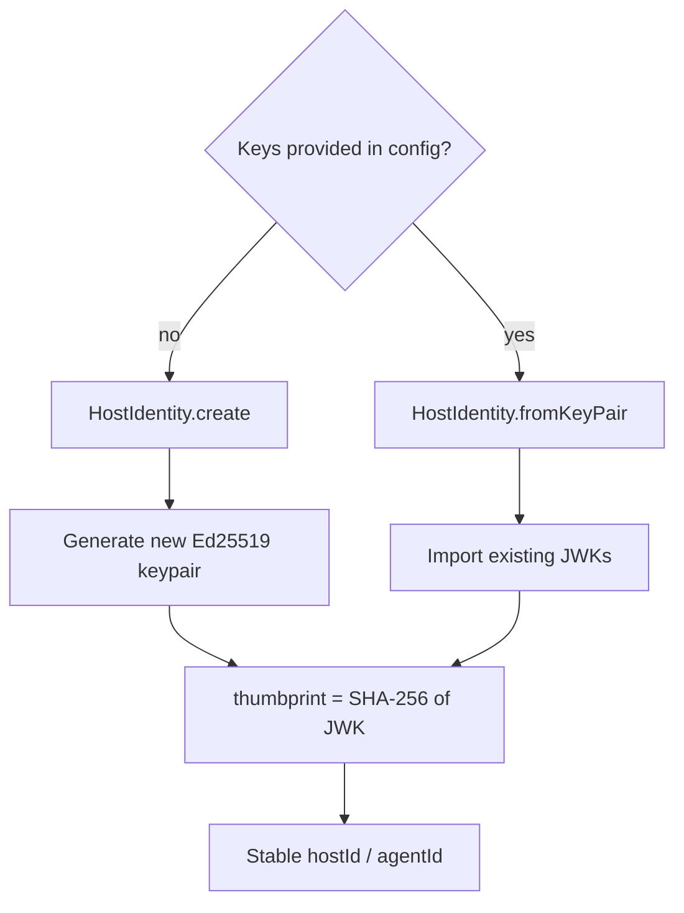

# Identity Persistence

By default, `AppChain.create()` generates fresh Ed25519 keypairs on every boot. To keep the same `hostId` and `agentId` across restarts, export the keys after first creation and restore them on subsequent boots.

## Export on First Boot

```typescript
const chain = await AppChain.create({
  providerName: 'my-service',
  issuer: 'https://myservice.com',
  capabilities: [...],
});

// Export — store these securely (secrets manager, encrypted config)
const hostPrivateKeyJwk = await chain.host.exportPrivateKeyJwk();
const hostPublicKeyJwk = chain.host.getPublicKeyJwk();

// Save agentId + agent keys too
const agentId = chain.agentId;
// Agent keys are accessible via the internal identity
```

## Restore on Subsequent Boots

```typescript
const chain = await AppChain.create({
  providerName: 'my-service',
  issuer: 'https://myservice.com',
  capabilities: [...],
  host: {
    privateKeyJwk: savedHostPrivateKeyJwk,
    publicKeyJwk: savedHostPublicKeyJwk,
  },
  agent: {
    agentId: savedAgentId,
    privateKeyJwk: savedAgentPrivateKeyJwk,
    publicKeyJwk: savedAgentPublicKeyJwk,
  },
});

// chain.host.hostId — same as first boot
// chain.agentId     — same as first boot
```

## How It Works



The ID is derived from the public key — it's deterministic. Same keypair = same ID.

## Best Practices

- Store private keys in a secrets manager (AWS Secrets Manager, Vault, etc.)
- Never log or expose private keys
- Rotate keys by generating new ones and re-registering agents
- The `agentId` changes when the keypair changes — update any stored grants
