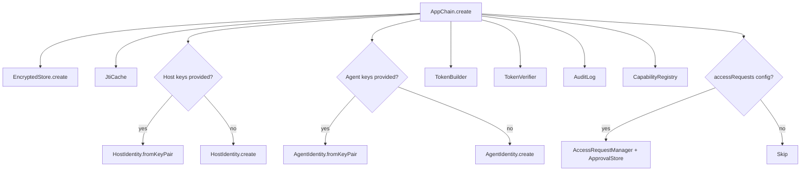
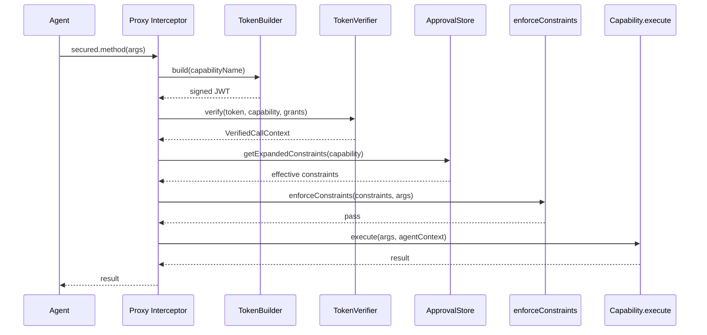
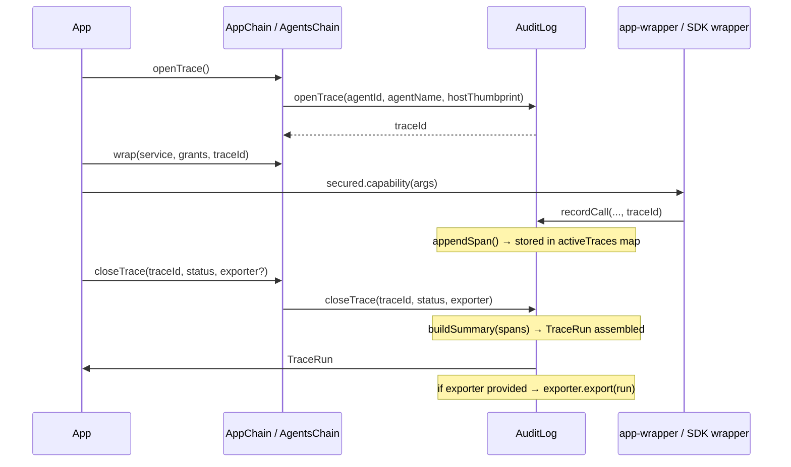
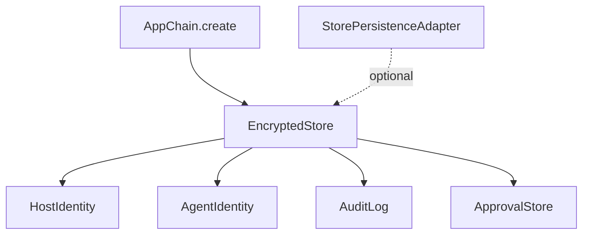

# Architecture

Internal structure and data flows of the `agents-chain` package.

## Module Map

```
agents-chain/
├── chain.ts                     AppChain (main entry point)
├── index.ts                     Public re-exports
│
├── host/
│   └── host-identity.ts         HostIdentity — Ed25519 keypair, thumbprint
│
├── identity/
│   └── agent-identity.ts        AgentIdentity — Ed25519 keypair, registration
│
├── auth/
│   ├── token-builder.ts         TokenBuilder — mints signed 60s JWTs
│   ├── token-verifier.ts        TokenVerifier — 11-step pipeline
│   └── constraints.ts           enforceConstraints() — field-level validation
│
├── app/
│   ├── capability-registry.ts   CapabilityRegistry — name → Capability map
│   └── app-wrapper.ts           wrapApp() — Proxy interceptor + access requests
│
├── access/
│   ├── access-request-manager.ts  HMAC codes, pending requests, approve/deny
│   └── approval-store.ts          Encrypted + HMAC-integrity rule storage
│
├── audit/
│   ├── audit-log.ts             AuditLog — in-memory buffer, AES-256-GCM, trace lifecycle
│   ├── audit-exporter.ts        Console + HTTP audit exporters
│   └── trace-exporter.ts        ConsoleTraceExporter + HttpTraceExporter
│
├── trace/
│   └── model-extractors.ts      Built-in Anthropic/OpenAI ModelMetadataExtractor, extractor registry
│
├── memory/
│   ├── encrypted-store.ts       EncryptedStore — AES-256-GCM Map
│   └── jti-cache.ts             JtiCache — 90s replay window
│
├── crypto/
│   ├── ed25519.ts               Key generation, sign/verify, JWK
│   └── utils.ts                 generateId, base64url
│
├── errors/
│   └── chain-error.ts           ChainAuthError, isChainAuthError()
│
├── wrappers/
│   ├── openai-wrapper.ts        OpenAI SDK Proxy
│   └── anthropic-wrapper.ts     Anthropic SDK Proxy
│
└── types/
    ├── capabilities.ts          Capability, AgentContext, GrantConstraints
    ├── chain.ts                 AppChainConfig, ChainStats
    ├── identity.ts              RegisteredAgent, CapabilityGrant
    ├── audit.ts                 AuditEntry, AuditResult
    ├── protocol.ts              ResolvedGrant, AgentConfiguration
    ├── access-request.ts        AccessRequest, ApprovalScope, ApprovalRule
    └── trace.ts                 TraceRun, TraceSpan, ModelMetadata, ModelMetadataExtractor
```

## AppChain Creation Flow



## Per-Call Pipeline



## Trace Data Flow



## Shared State

All chain state flows through one `EncryptedStore`:


