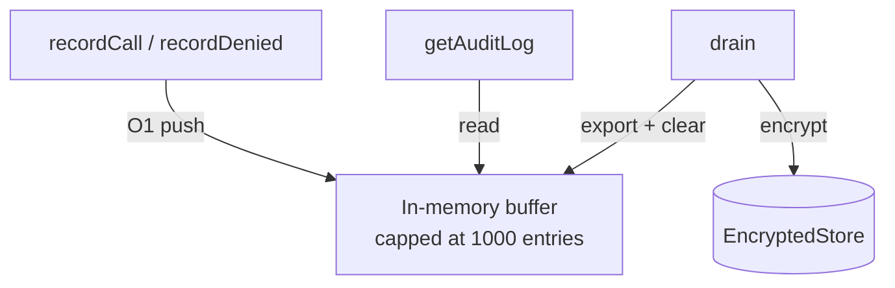

# Audit Log

Every capability call — successful, denied, or errored — is recorded in an AES-256-GCM encrypted in-memory buffer. The audit log is your source of truth for what agents did and when.

## Reading the Log

```typescript
// All entries (decrypted in-memory, no I/O)
const entries = chain.getAuditLog();

// Summary stats including auth overhead
const stats = chain.getStats();
// {
//   agentId, hostId, agentName, hostname,
//   totalCalls, successfulCalls, deniedCalls, errorCalls,
//   registeredAt,
//   authOverhead: { avgMs, maxMs }
// }
```

## Audit Entry Fields

| Field | Type | Description |
|-------|------|-------------|
| `id` | `string` | Unique entry ID |
| `agentId` | `string` | Agent that made the call |
| `agentName` | `string` | Human-readable agent name |
| `capability` | `string` | Capability requested |
| `args` | `object` | Sanitized call arguments |
| `result` | `"success" \| "denied" \| "error"` | Outcome |
| `denialReason` | `string?` | Set when `result === "denied"` |
| `jti` | `string` | JWT ID (replay protection key) |
| `timestamp` | `number` | Unix ms |
| `durationMs` | `number` | Execution time in ms |
| `authOverheadMs` | `number` | Time spent in build + verify |
| `modelMetadata` | `ModelMetadata?` | LLM metadata when the call went through an SDK wrapper (tokens, model, tool calls) |

## Argument Sanitization

Sensitive fields are automatically redacted before logging:

```
Keys matching: key, secret, token, password, auth, credential, bearer
→ replaced with "[REDACTED]"
```

This happens automatically — you don't need to configure it.

## Draining

The buffer is capped at 1000 entries (O(1) appends, oldest evicted). Drain it to an external system periodically or on shutdown:

```typescript
// Drain using the configured exporter
await chain.drain();

// Or override with an ad-hoc exporter
await chain.drain(new ConsoleAuditExporter());
```

## Exporters

Two built-in exporters:

### ConsoleAuditExporter

Logs entries to the console. Good for development:

```typescript
import { ConsoleAuditExporter } from 'agents-chain';

const chain = await AppChain.create({
  // ...
  auditExporter: new ConsoleAuditExporter(),
});
```

### HttpAuditExporter

Posts entries to an HTTP endpoint:

```typescript
import { HttpAuditExporter } from 'agents-chain';

const chain = await AppChain.create({
  // ...
  auditExporter: new HttpAuditExporter({
    endpoint: 'https://audit.mycompany.com/ingest',
    apiKey: process.env.AUDIT_API_KEY,
  }),
});
```

### Custom Exporter

Implement the `AuditExporter` interface:

```typescript
const myExporter = {
  async export(entries) {
    for (const entry of entries) {
      await myDatabase.insert('audit_log', entry);
    }
  },
};
```

## Traces vs Audit Entries

The audit log and the trace system share the same data source — every `recordCall()` / `recordDenied()` call writes to both. The difference is scope:

- **Audit entries** — individual call records, persisted in the ring buffer, queryable with `getAuditLog()`
- **Trace spans** — the same data, but grouped into a `TraceRun` that covers an entire agent session

Open a trace with `chain.openTrace()` and pass the `traceId` to `wrap()` or `openai()`/`anthropic()`. All calls within that session automatically become spans on the open trace. `modelMetadata` (token counts, model name, tool calls) is attached to both the audit entry and the span when the call goes through an LLM SDK wrapper.

See [Tracing & Observability](./tracing) for the full API.

## Internals



The buffer is never encrypted per-append. Encryption happens only when `flush()` or `drain()` is called. Reads are always in-memory.
