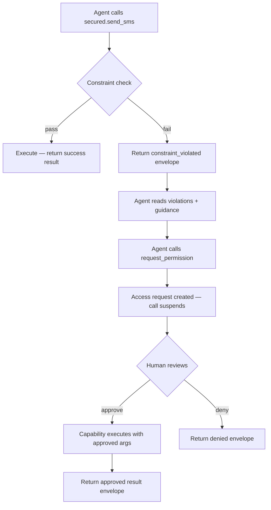

# Context Awareness

**Context-aware mode** changes how agents experience constraint violations. Instead of receiving a thrown error, the agent gets a structured result envelope — a `ConstraintAwareResult` — that describes exactly what went wrong and what to do next. This lets the agent reason about its own permissions and participate in the approval flow.

## Enabling It

Set `constraintAware: true` in `AppChain.create`:

```typescript
const chain = await AppChain.create({
  providerName: 'sms-service',
  issuer: 'https://sms.example.com',
  capabilities: [sendSmsCapability],
  constraintAware: true,
});
```

When `constraintAware` is `false` (the default), constraint violations throw a `ChainAuthError`. Enabling this flag keeps backward-compatible behavior for unconstrained paths, but switches violations to return structured results.

## The ConstraintAwareResult Envelope

Every capability call returns a `ConstraintAwareResult` when this mode is on:

```typescript
type ConstraintAwareResult<T = unknown> = {
  success: boolean;           // true if the call succeeded
  result?: T;                 // the actual return value (when success=true)
  permission: PermissionStatus;
  violations?: ConstraintViolationDetail[];
  grant?: PermissionGrant;    // details when permission='approved'
  guidance: string;           // AI-readable next-step instructions
  capability: string;
  activeConstraints?: Record<string, unknown>;
};
```

### Permission Statuses

| Status | Meaning |
|--------|---------|
| `not_required` | Call passed all constraints — `result` is populated |
| `constraint_violated` | A constraint check failed — `violations` describe what |
| `approved` | A human approved this call via `request_permission` |
| `denied` | A human denied the access request |
| `expired` | The approval request timed out |

## Receiving Tool Output and Structured Violations

When a constraint is violated, the envelope includes a `violations` array with per-field detail:

```typescript
type ConstraintViolationDetail = {
  field: string;                              // which input field failed
  constraint: 'in' | 'not_in' | 'max' | 'min' | 'exact';
  expected: unknown;                          // the constraint definition
  actual: unknown;                            // what the agent passed
  message: string;                            // human/AI-readable explanation
};
```

Example: an agent tries to send an SMS to a number not in the approved list:

```typescript
const result = await secured.send_sms({ to: '+9999999', body: 'hello' });
// result.success       → false
// result.permission    → 'constraint_violated'
// result.violations    → [{ field: 'to', constraint: 'in', actual: '+9999999', expected: ['+254700000001'] }]
// result.activeConstraints → { to: { in: ['+254700000001'] } }
// result.guidance      → "Constraint violated ... call request_permission ..."
```

The agent can inspect `violations` and `activeConstraints` to understand exactly which values are allowed without having to ask for help blindly.

## Telling the Agent Its Constraints Upfront

Use `getConstraintContext(grants)` to generate a system-prompt block that describes all active constraints in natural language:

```typescript
const systemPromptBlock = chain.getConstraintContext(grants);
```

This produces text the agent can read at startup:

```
You are operating under capability constraints enforced by the agents-chain protocol.
When a call violates a constraint, you will receive a structured violation result.
You have access to a "request_permission" tool that lets you request human approval for blocked calls.

Active constraints:
  - send_sms:
      to: must be one of ["+254700000001", "+254700000002"]

If you need to use a value outside these constraints, call request_permission with the capability name, args, and reason.
A human operator will review your request.
```

Include this in your agent's system prompt so it understands the rules before making any calls — reducing unnecessary violations.

## The request_permission Capability

When `constraintAware: true` and `accessRequests` are both configured, a `request_permission` capability is automatically registered. The agent can call it explicitly after receiving a `constraint_violated` result:

```typescript
const result = await secured.request_permission({
  capability: 'send_sms',
  args: { to: '+9999999', body: 'User asked me to notify this number' },
  reason: 'The user explicitly requested this number be contacted',
});
```

The call **suspends** until a human approves or denies it via `chain.approve()` / `chain.deny()`. When approved, the capability executes immediately and the result is returned inside the `ConstraintAwareResult`.

### Full flow



### After approval

When a human approves with `scope: 'value'`, the approval is stored and **subsequent calls with the same argument value pass without re-requesting**:

```typescript
// Human approved '+9999999' with scope: 'value'
chain.approve({ requestId, code, scope: 'value' });

// Later calls with the same value go straight through
const result = await secured.send_sms({ to: '+9999999', body: 'second message' });
// result.permission → 'not_required'  ← no re-approval needed
```

## Setting Up Context-Aware Mode

```typescript
import { AppChain } from 'agents-chain';

const chain = await AppChain.create({
  providerName: 'sms-service',
  issuer: 'https://sms.example.com',
  capabilities: [
    {
      name: 'send_sms',
      description: 'Send an SMS message',
      inputSchema: {
        type: 'object',
        required: ['to', 'body'],
        properties: {
          to: { type: 'string' },
          body: { type: 'string' },
        },
      },
      outputSchema: { type: 'object' },
      execute: async ({ to, body }) => {
        // your actual SMS logic
        return { sent: true, to, body };
      },
    },
  ],
  constraintAware: true,
  accessRequests: {
    approvalSecret: process.env.APPROVAL_SECRET!,
    requestTTLMs: 60_000,
    notifier: {
      async notify(request) {
        // send Slack/email to human reviewer
      },
      async onResolved(request, outcome) {
        // optional: log the decision
      },
    },
  },
});

// Build grants for this agent session
const grants = [
  { capability: 'send_sms', status: 'active', constraints: { to: { in: ['+254700000001'] } } },
];

// Inject constraint context into your AI agent's system prompt
const systemPrompt = chain.getConstraintContext(grants);

// Wrap your service
const secured = chain.wrap(myService, grants);

// The agent uses `secured` — on violation it gets structured results, not thrown errors
```

## Comparison: Default vs Context-Aware

| Behavior | `constraintAware: false` (default) | `constraintAware: true` |
|---|---|---|
| Constraint violation | Throws `ChainAuthError` | Returns `ConstraintAwareResult` |
| Agent sees violation detail | Via `err.structuredViolations` | Via `result.violations` |
| Agent guidance | Must be coded manually | Included in `result.guidance` |
| `request_permission` tool | Not available | Auto-registered |
| System prompt helper | Not available | `getConstraintContext()` |
| Backward compatible | Yes (default) | Must opt in |

## Without Access Requests

You can use `constraintAware: true` without enabling `accessRequests`. In this case, violations still return structured results, but the guidance will say that the access request system is not available — the agent must adjust its arguments instead:

```typescript
const chain = await AppChain.create({
  providerName: 'service',
  issuer: 'https://example.com',
  capabilities: [...],
  constraintAware: true,
  // no accessRequests
});
```

The `request_permission` capability is not registered in this mode.
