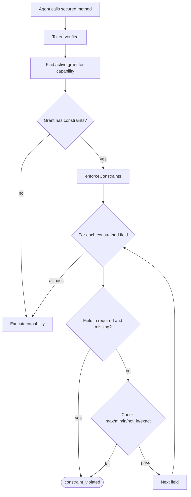

# Grants & Constraints

A **Grant** says "this agent is allowed to call this capability." Grants carry a status, optional expiry, and optional **constraints** that restrict what argument values are allowed.

## Grant Structure

```typescript
const grants = [
  {
    capability: 'createInvoice',
    status: 'active',                    // only 'active' grants are enforced
    constraints: {
      amount: { max: 1000 },             // amount must be <= 1000
      currency: { in: ['USD', 'EUR'] },  // must be one of these
    },
    expiresAt: Date.now() + 86_400_000,  // 24h from now
  },
];
```

## Grant Status

| Status | Meaning |
|--------|---------|
| `active` | The grant is currently valid and enforced |
| `revoked` | The grant has been revoked — calls are denied |
| `expired` | The grant has expired — calls are denied |

Only `active` grants allow capability calls. A grant with `expiresAt` in the past is treated as expired even if `status` is `active`.

## Constraint Operators

Constraints are field-level rules on the call arguments:

| Constraint | Example | Meaning |
|------------|---------|---------|
| `{ max: N }` | `{ max: 1000 }` | Value must be `<= N` |
| `{ min: N }` | `{ min: 0 }` | Value must be `>= N` |
| `{ in: [...] }` | `{ in: ['USD', 'EUR'] }` | Value must be in the list |
| `{ not_in: [...] }` | `{ not_in: ['ADMIN'] }` | Value must not be in the list |
| Exact primitive | `'standard'` | Value must equal exactly |

You can combine operators on a single field:

```typescript
constraints: {
  amount: { min: 0, max: 5000 },               // 0 <= amount <= 5000
  currency: { in: ['USD', 'EUR', 'GBP'] },     // must be one of these
  category: 'standard',                          // exact equality
  role: { not_in: ['ADMIN', 'SUPERUSER'] },     // can't use these roles
}
```

## Required Field Enforcement

Fields listed in the capability's `inputSchema.required` array are also enforced — a missing required field is a constraint violation, not a silent pass:

```typescript
// Capability defines: required: ['customerId', 'amount']

await secured.createInvoice({ amount: 500 });
// ❌ throws constraint_violated — customerId is required but missing

await secured.createInvoice({ customerId: 'c1', amount: 500 });
// ✅ passes — all required fields present
```

## How Constraints Are Enforced



Constraint enforcement runs **before** the capability's `execute` function. If a constraint is violated, the AT API (or whatever service) is never reached.

## Example: SMS Number Whitelist

A common pattern — only allow the agent to send SMS to approved numbers:

```typescript
const grants = [
  {
    capability: 'send_sms',
    status: 'active',
    constraints: {
      to: { in: ['+254712345678', '+254700000001'] },
    },
    expiresAt: Date.now() + 24 * 60 * 60 * 1000,
  },
];

await secured.send_sms({ to: '+254712345678', message: 'Hello' });
// ✅ Number is in the approved list

await secured.send_sms({ to: '+254999999999', message: 'Hello' });
// ❌ constraint_violated — not in the allowed list
```

With [Access Requests](/docs/access-requests/overview) enabled, the denied call can **suspend** instead of throwing, allowing a human to approve the new number on the fly.
