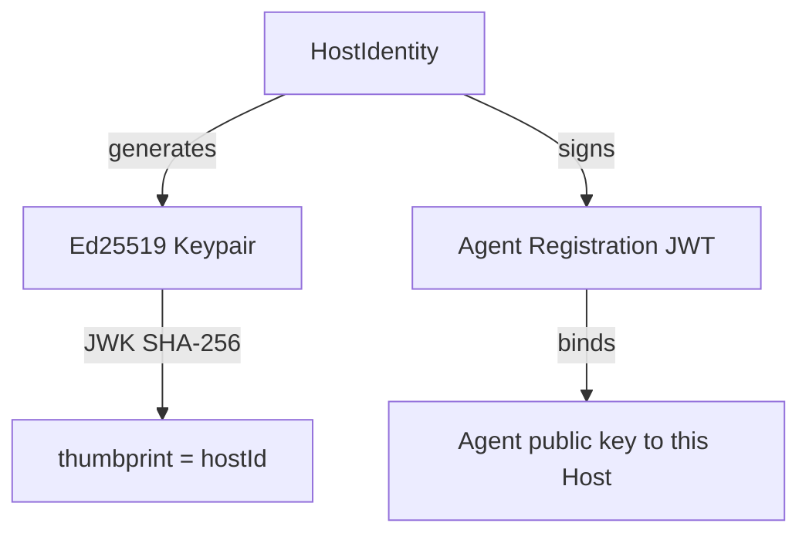
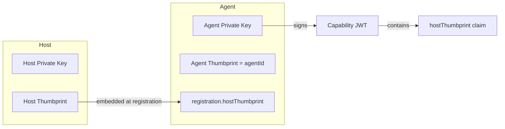

# Host & Agent Identity

Every agents-chain deployment has two cryptographic identities: a **Host** and an **Agent**. Together they form a delegation chain that ties every capability call back to a trusted authority.

## Host

A `HostIdentity` holds an Ed25519 keypair and acts as the cryptographic anchor. Its JWK thumbprint (SHA-256) is the stable `hostId`. The Host signs agent registration JWTs that bind an agent's public key to a specific host.



```typescript
// Access the host from a chain
const { host } = chain;

console.log(host.hostId);       // stable thumbprint
console.log(host.thumbprint);   // same as hostId

// Export for persistence
const privateKeyJwk = await host.exportPrivateKeyJwk();
const publicKeyJwk = host.getPublicKeyJwk();

// Sign host JWTs
const hostJwt = await host.signHostJwt();
const registrationJwt = await host.signAgentRegistrationJwt(agentPublicKeyJwk);
```

## Agent

An `AgentIdentity` holds its own Ed25519 keypair, is registered under a Host (carrying the host's `thumbprint`), and is granted capabilities. Every capability call mints a JWT signed with the agent's private key — the verifier checks the full delegation chain back to the Host.



## The Delegation Chain

When an agent calls a capability, the JWT contains:

| Claim | Source |
|-------|--------|
| `sub` | Agent's `agentId` (JWK thumbprint) |
| `iss` | Agent's JWK thumbprint |
| `aud` | Capability name |
| `hostThumbprint` | The Host that registered this agent |

The verifier checks that `hostThumbprint` in the token matches the agent's registered Host. A rogue agent cannot impersonate a registered one because it cannot produce a valid signature with the registered agent's private key.

## Stable IDs

Both `hostId` and `agentId` are derived from the public key — they are deterministic. The same keypair always produces the same ID. This means you can:

1. Generate keypairs on first boot
2. Export and persist the JWKs
3. Restore them on subsequent boots
4. Get the exact same `hostId` and `agentId` back

See [Identity Persistence](/docs/advanced/identity-persistence) for details.
