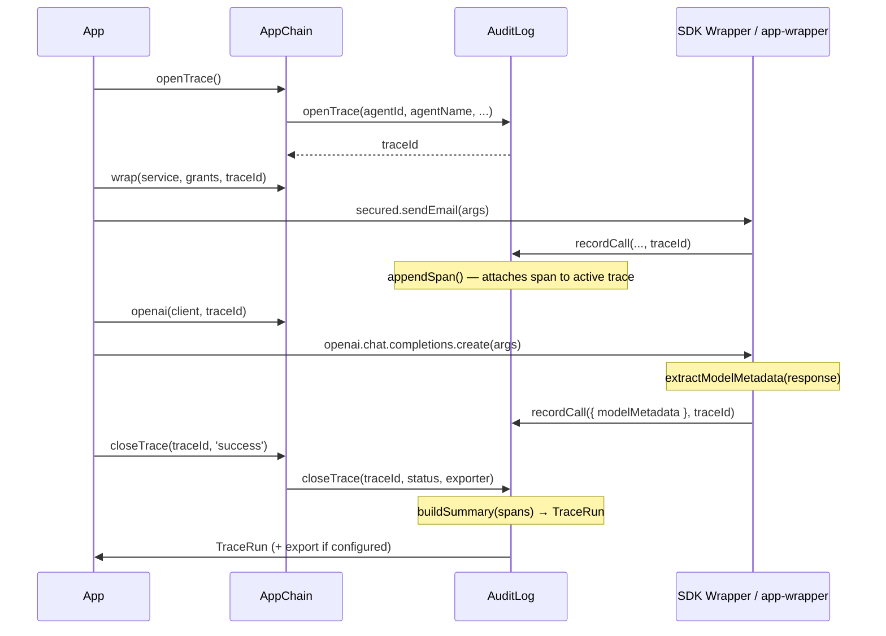

# Tracing & Observability

agents-chain includes a built-in trace system that records a complete picture of each agent session — every capability call, every LLM invocation, token counts, tool calls, and the overall session outcome — as a single exportable `TraceRun`.

## The Model

```
TraceRun (one agent session)
├── traceId, agentId, agentName, status, startedAt, endedAt
├── summary  ← rolled-up counters: tokens, models used, span counts
└── spans[]  ← one TraceSpan per capability call
    ├── spanId, capability, result, durationMs, authOverheadMs
    └── modelMetadata?  ← tokens, model name, tool calls, stop reason
```

One `TraceRun` = one open/close bracket around an agent session. Spans accumulate automatically as capability calls happen inside that bracket.

## Quick Start

```typescript
import { AppChain, HttpTraceExporter } from 'agents-chain';

const chain = await AppChain.create({
  providerName: 'my-service',
  issuer: 'https://myservice.com',
  capabilities: [...],
  traceExporter: new HttpTraceExporter({
    endpoint: 'https://gateway.melduo.com/traces',
    apiKey: process.env.MELDUO_API_KEY,
  }),
});

// 1. Open a trace at session start
const traceId = chain.openTrace();

// 2. Pass traceId into wrap() so capability calls are grouped
const secured = chain.wrap(myService, grants, traceId);
await secured.sendEmail({ to: 'user@example.com', subject: 'Hello' });
await secured.sendSms({ to: '+1234567890', message: 'Hi' });

// 3. Close the trace — exports the completed TraceRun
const run = await chain.closeTrace(traceId, 'success');
```

The `run` object contains the full session summary, all spans, and token totals.

## LLM SDK Tracing

When you use the `chain.openai()` or `chain.anthropic()` wrappers, pass the `traceId` to automatically attach LLM metadata (model name, token counts, tool calls, stop reason) to each span:

```typescript
import OpenAI from 'openai';
import Anthropic from '@anthropic-ai/sdk';

const traceId = chain.openTrace();

// OpenAI — every chat.completions.create call gets a span with token metadata
const openai = chain.openai(new OpenAI({ apiKey: '...' }), traceId);
const response = await openai.chat.completions.create({
  model: 'gpt-4o',
  messages: [{ role: 'user', content: 'Summarize this.' }],
});

// Anthropic — same for messages.create
const anthropic = chain.anthropic(new Anthropic({ apiKey: '...' }), traceId);
await anthropic.messages.create({
  model: 'claude-sonnet-4-6',
  max_tokens: 1024,
  messages: [{ role: 'user', content: 'Hello' }],
});

const run = await chain.closeTrace(traceId, 'success');
console.log(run.summary.totalTokens);     // total across all LLM calls
console.log(run.summary.modelsUsed);      // ["gpt-4o", "claude-sonnet-4-6"]
```

## TraceRunStatus

Pass one of three statuses to `closeTrace()`:

| Status | When to use |
|--------|-------------|
| `"success"` | Agent session completed without errors |
| `"failed"` | Agent session ended due to an unrecoverable error |
| `"partial"` | Session partially completed (e.g. interrupted) |

## TraceRunSummary

The `summary` field is computed automatically from all spans:

```typescript
type TraceRunSummary = {
  totalSpans: number;
  successSpans: number;
  deniedSpans: number;
  errorSpans: number;
  totalInputTokens: number;
  totalOutputTokens: number;
  totalTokens: number;
  modelsUsed: string[];       // e.g. ["claude-sonnet-4-6"]
  providersUsed: string[];    // e.g. ["anthropic"]
};
```

## Exporters

### ConsoleTraceExporter

Prints the completed `TraceRun` as formatted JSON. Good for development:

```typescript
import { ConsoleTraceExporter } from 'agents-chain';

const run = await chain.closeTrace(traceId, 'success', new ConsoleTraceExporter());
```

### HttpTraceExporter

Ships the `TraceRun` as a single POST to a collector endpoint:

```typescript
import { HttpTraceExporter } from 'agents-chain';

const chain = await AppChain.create({
  // ...
  traceExporter: new HttpTraceExporter({
    endpoint: 'https://gateway.melduo.com/traces',
    apiKey: process.env.MELDUO_API_KEY,
    timeoutMs: 10_000,  // default
  }),
});
```

The body sent is `{ run: TraceRun }`.

### Custom Exporter

Implement the `TraceExporter` interface to ship runs anywhere:

```typescript
import type { TraceExporter, TraceRun } from 'agents-chain';

const myExporter: TraceExporter = {
  async export(run: TraceRun) {
    await db.insert('agent_runs', {
      id: run.traceId,
      agent: run.agentName,
      status: run.status,
      tokens: run.summary.totalTokens,
      spans: JSON.stringify(run.spans),
    });
  },
};
```

### Per-close override

The `traceExporter` in config is the default. You can override it per `closeTrace()` call:

```typescript
// uses the default traceExporter from config
await chain.closeTrace(traceId, 'success');

// uses a one-off exporter for this specific run
await chain.closeTrace(traceId, 'failed', new ConsoleTraceExporter());
```

## Custom Model Extractors

agents-chain ships built-in extractors for Anthropic and OpenAI. For other providers, register a custom `ModelMetadataExtractor`:

```typescript
import { registerExtractor } from 'agents-chain';

registerExtractor({
  provider: 'google',
  canExtract(response) {
    return typeof response === 'object' && response !== null && 'usageMetadata' in response;
  },
  extract(response, requestArgs) {
    const r = response as any;
    const toolCalls = r.candidates?.[0]?.content?.parts
      ?.filter((p: any) => p.functionCall)
      ?.map((p: any) => ({ name: p.functionCall.name, input: p.functionCall.args }));
    return {
      model: r.modelVersion ?? requestArgs?.model ?? 'unknown',
      provider: 'google',
      inputTokens: r.usageMetadata?.promptTokenCount,
      outputTokens: r.usageMetadata?.candidatesTokenCount,
      totalTokens: r.usageMetadata?.totalTokenCount,
      temperature: requestArgs?.generationConfig?.temperature,
      toolCalls: toolCalls?.length > 0 ? toolCalls : undefined,
      stopReason: r.candidates?.[0]?.finishReason,
    };
  },
});
```

Custom extractors are checked before the built-in ones. The first extractor whose `canExtract()` returns `true` is used.

## How It Works



## Trace Spans and the Audit Log

Trace spans and audit log entries share the same underlying data — every `recordCall()` / `recordDenied()` call both writes to the audit buffer and, if a `traceId` is active, appends a span to the open trace. `modelMetadata` is stored on both the `AuditEntry` and the `TraceSpan`.

The audit log persists (ring buffer, max 1000 entries). Traces are in-memory only — they live until `closeTrace()` is called.
