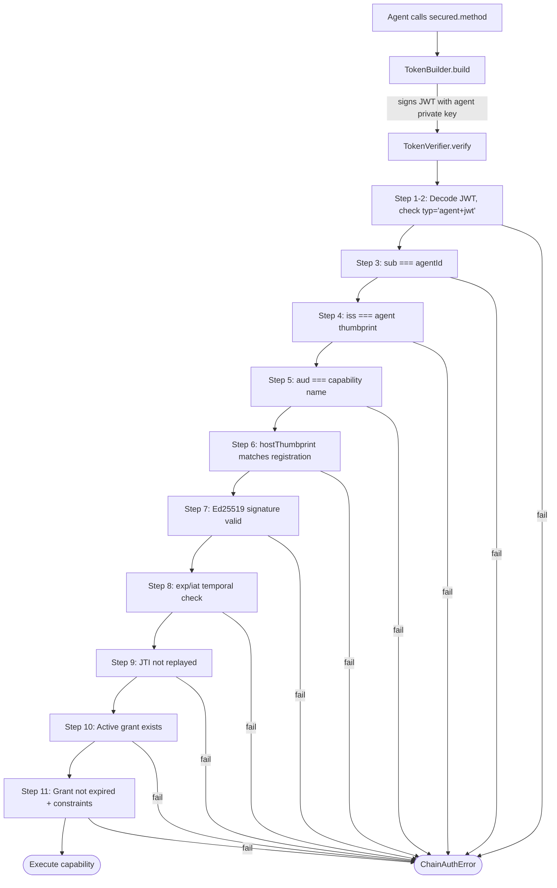

# 11-Step Verification Pipeline

Every intercepted capability call goes through this pipeline before your code runs. A fresh JWT is minted and verified on every call — no token reuse.

## The Pipeline



## Step-by-Step

| Step | What is checked | Error on failure |
|------|----------------|-----------------|
| 1-2 | Decode JWT header + payload, confirm `typ = "agent+jwt"` | `token_invalid` |
| 3 | `sub` matches registered `agentId` | `agent_not_found` |
| 4 | `iss` matches registered public key thumbprint | `token_invalid` |
| 5 | `aud` matches the requested capability name | `capability_denied` |
| 6 | `hostThumbprint` in token matches agent's registered Host | `token_invalid` |
| 7 | Ed25519 signature is valid | `token_invalid` |
| 8 | `exp`/`iat` temporal check (30s clock skew tolerance) | `token_expired` / `token_invalid` |
| 9 | JTI not seen in the 90-second replay window | `token_replayed` |
| 10 | Agent holds an `active` grant for this capability | `capability_denied` |
| 11 | Grant has not expired (`expiresAt`) | `capability_denied` |
| 11b | Call arguments satisfy all grant constraints + required fields | `constraint_violated` |

## JWT Claims

Every capability call mints a JWT with these claims:

```json
{
  "typ": "agent+jwt",
  "alg": "EdDSA",
  "sub": "<agentId>",
  "iss": "<agent JWK thumbprint>",
  "aud": "<capability name>",
  "hostThumbprint": "<Host JWK thumbprint>",
  "jti": "<random 128-bit base64url>",
  "iat": 1700000000,
  "exp": 1700000060,
  "hostname": "<agent hostname>",
  "agentName": "<agent name>"
}
```

The token is:
- **Signed** with the agent's Ed25519 private key
- **Single-use** — a unique `jti` per call (replayed within 90s = rejected)
- **Short-lived** — 60-second TTL
- **Scoped** — `aud` must exactly match the capability name

## JTI Replay Protection

The `jti` (JWT ID) is cached for 90 seconds. If the same `jti` appears again within that window, the call is rejected with `token_replayed`. This prevents replay attacks even if an attacker captures a valid token.

By default, JTI tracking is in-memory. For multi-process deployments, inject a [Redis adapter](/docs/advanced/store-adapters#jti-adapter).

## Auth Overhead

The entire pipeline runs in-process via Node.js Web Crypto. Typical warm-path overhead is **under 1ms per call**:

```typescript
const stats = chain.getStats();
// stats.authOverhead → { avgMs: number, maxMs: number }
```

Every audit entry records `authOverheadMs` so you can monitor the cost of the auth pipeline.
