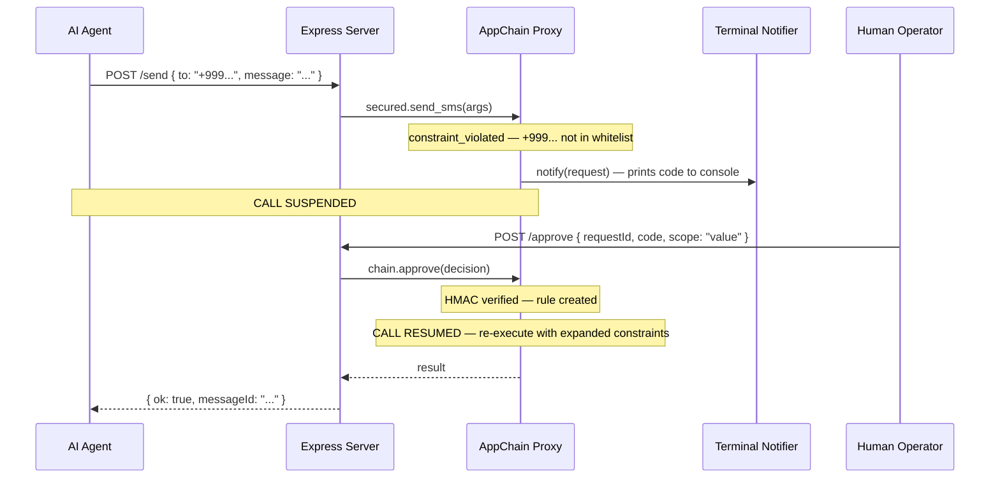

# Example: Access Request Flow

End-to-end example showing how an agent's blocked call suspends, a human approves via an API endpoint, and the call resumes.

## Architecture



## Full Example

```typescript
import express from 'express';
import { AppChain, isChainAuthError } from 'agents-chain';
import type { AccessRequest } from 'agents-chain';

const app = express();
app.use(express.json());

// ── SMS function ────────────────────────────────────────────────────
async function sendSms(args: { to: string; message: string }) {
  console.log(`[SMS] Sent to ${args.to}: "${args.message}"`);
  return { messageId: `msg_${Date.now()}`, status: 'sent', to: args.to };
}

// ── Terminal notifier ───────────────────────────────────────────────
// Prints the verification code to the server console
const terminalNotifier = {
  async notify(request: AccessRequest) {
    const divider = '='.repeat(60);
    console.log(`\n${divider}`);
    console.log('  ACCESS REQUEST PENDING');
    console.log(divider);
    console.log(`  Request ID : ${request.requestId}`);
    console.log(`  Agent      : ${request.agentName}`);
    console.log(`  Capability : ${request.capability}`);
    console.log(`  Args       : ${JSON.stringify(request.args)}`);
    console.log(`  Reason     : ${request.reason}`);
    console.log(`  Code       : ${request.verificationCode}`);
    console.log(divider);
    console.log(`  APPROVE: curl -X POST http://localhost:3000/approve \\`);
    console.log(`    -H "Content-Type: application/json" \\`);
    console.log(`    -d '{"requestId":"${request.requestId}","code":"${request.verificationCode}","scope":"value"}'`);
    console.log(`${divider}\n`);
  },
  async onResolved(request: AccessRequest, outcome: string) {
    console.log(`[Access Request] ${outcome.toUpperCase()}: ${request.requestId}`);
  },
};

// ── AppChain with access requests ───────────────────────────────────
const chain = await AppChain.create({
  providerName: 'sms-gateway',
  issuer: 'https://sms.example.com',
  capabilities: [
    {
      name: 'send_sms',
      description: 'Send an SMS message',
      inputSchema: {
        type: 'object',
        required: ['to', 'message'],
        properties: {
          to: { type: 'string' },
          message: { type: 'string' },
        },
      },
      outputSchema: { type: 'object' },
      execute: async (args) => sendSms(args as { to: string; message: string }),
    },
  ],
  accessRequests: {
    approvalSecret: process.env.APPROVAL_SECRET || 'dev-secret-change-in-production',
    requestTTLMs: 5 * 60 * 1000,  // 5 minutes
    notifier: terminalNotifier,
  },
});

// ── Grants — only approved numbers ──────────────────────────────────
const APPROVED = ['+254712345678'];

function getGrants() {
  return [{
    capability: 'send_sms',
    status: 'active' as const,
    constraints: { to: { in: APPROVED } },
    expiresAt: Date.now() + 86_400_000,
  }];
}

// ── Send endpoint ───────────────────────────────────────────────────
// With access requests enabled, this call SUSPENDS instead of throwing
// when the number is not in the whitelist.
app.post('/send', async (req, res) => {
  const { to, message } = req.body;
  const service = { send_sms: sendSms };
  const secured = chain.wrap(service, getGrants());

  try {
    // This will BLOCK if the number is not approved —
    // waiting for human approval via POST /approve
    const result = await (secured as typeof service).send_sms({ to, message });
    res.json({ ok: true, ...result });
  } catch (err) {
    if (isChainAuthError(err)) {
      res.json({ ok: false, error: err.code, message: err.message });
    } else {
      res.status(500).json({ error: 'Internal error' });
    }
  }
});

// ── Approve endpoint ────────────────────────────────────────────────
app.post('/approve', (req, res) => {
  const { requestId, code, scope, ttl } = req.body;
  try {
    const result = chain.approve({ requestId, code, scope: scope || 'call', ttl });
    res.json({ ok: true, capability: result.capability, scope });
  } catch (err) {
    res.status(400).json({ error: String(err) });
  }
});

// ── Deny endpoint ───────────────────────────────────────────────────
app.post('/deny', (req, res) => {
  const { requestId, code, reason } = req.body;
  try {
    chain.deny({ requestId, code, reason });
    res.json({ ok: true });
  } catch (err) {
    res.status(400).json({ error: String(err) });
  }
});

// ── Pending requests endpoint ───────────────────────────────────────
app.get('/pending', (_req, res) => {
  res.json({ requests: chain.getPendingRequests() });
});

// ── Start ───────────────────────────────────────────────────────────
app.listen(3000, () => {
  console.log('SMS Gateway with Access Requests on http://localhost:3000');
  console.log('Approved numbers:', APPROVED.join(', '));
  console.log('\nTry: curl -X POST http://localhost:3000/send \\');
  console.log('  -H "Content-Type: application/json" \\');
  console.log('  -d \'{"to": "+254999999999", "message": "Hello"}\'');
  console.log('\nThe call will SUSPEND. Check this terminal for the approval code.\n');
});
```

## Step-by-Step Walkthrough

### Terminal 1: Start the server

```bash
APPROVAL_SECRET=$(openssl rand -hex 32) npx tsx example.ts
```

### Terminal 2: Send to an unapproved number

```bash
curl -X POST http://localhost:3000/send \
  -H "Content-Type: application/json" \
  -d '{"to": "+254999999999", "message": "Payment received"}'
```

This curl will **hang** — the call is suspended waiting for approval.

### Terminal 1: See the access request

```
============================================================
  ACCESS REQUEST PENDING
============================================================
  Request ID : areq_abc123...
  Agent      : sms-gateway
  Capability : send_sms
  Args       : {"to":"+254999999999","message":"Payment received"}
  Code       : A3F7C209
============================================================
```

### Terminal 3: Approve it

```bash
# One-time approval
curl -X POST http://localhost:3000/approve \
  -H "Content-Type: application/json" \
  -d '{"requestId":"areq_abc123...","code":"A3F7C209","scope":"call"}'

# Or approve the value for the session
curl -X POST http://localhost:3000/approve \
  -H "Content-Type: application/json" \
  -d '{"requestId":"areq_abc123...","code":"A3F7C209","scope":"value"}'
```

### Terminal 2: See the result

```json
{"ok": true, "messageId": "msg_...", "status": "sent", "to": "+254999999999"}
```

The original curl that was hanging now returns — the call resumed after approval.

## What Happens with Each Scope

| Scope | What happens next |
|-------|-------------------|
| `call` | SMS sends. Next call to `+254999999999` prompts again. |
| `value` | SMS sends. Future calls to `+254999999999` go through automatically. |
| `capability` | SMS sends. All future SMS calls go through (any number). |
| `global` | SMS sends. Rule persists across restarts. |
