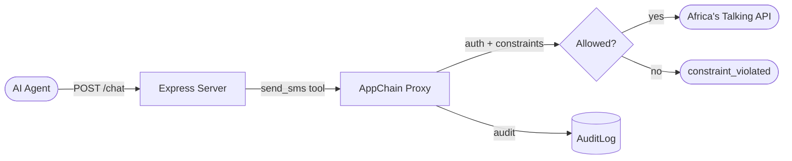

# Example: SMS Gateway with Express

A real-world pattern: an Express API that lets an AI agent send SMS via Africa's Talking, with agents-chain gating which numbers the agent can reach.

## Architecture



## Full Example

```typescript
import express from 'express';
import { AppChain, HttpAuditExporter, isChainAuthError } from 'agents-chain';

const app = express();
app.use(express.json());

// ── SMS Service ─────────────────────────────────────────────────────
// The agent NEVER sees the API key — the service holds credentials
async function sendSms(args: { to: string; message: string }) {
  console.log(`[SMS] Sending to ${args.to}: "${args.message}"`);
  // In production: call Africa's Talking / Twilio / etc.
  return {
    messageId: `msg_${Date.now()}`,
    status: 'sent',
    to: args.to,
  };
}

// ── AppChain Setup ──────────────────────────────────────────────────
const chain = await AppChain.create({
  providerName: 'sms-gateway',
  issuer: 'https://sms.mycompany.com',
  capabilities: [
    {
      name: 'send_sms',
      description: 'Send an SMS message',
      inputSchema: {
        type: 'object',
        required: ['to', 'message'],
        properties: {
          to: { type: 'string', description: 'Phone number in E.164 format' },
          message: { type: 'string', description: 'SMS content' },
        },
      },
      outputSchema: {
        type: 'object',
        properties: {
          messageId: { type: 'string' },
          status: { type: 'string' },
        },
      },
      execute: async (args) => sendSms(args as { to: string; message: string }),
    },
  ],
  auditExporter: new HttpAuditExporter({
    endpoint: 'https://audit.mycompany.com/ingest',
    apiKey: process.env.AUDIT_API_KEY || '',
  }),
});

// ── Approved numbers ────────────────────────────────────────────────
const APPROVED_NUMBERS = ['+254712345678', '+254700000001'];

function getGrants() {
  return [
    {
      capability: 'send_sms',
      status: 'active' as const,
      constraints: {
        to: { in: APPROVED_NUMBERS },
      },
      expiresAt: Date.now() + 24 * 60 * 60 * 1000,
    },
  ];
}

// ── API Endpoint ────────────────────────────────────────────────────
app.post('/send', async (req, res) => {
  const { to, message } = req.body;

  if (!to || !message) {
    return res.status(400).json({ error: 'to and message are required' });
  }

  // Wrap the service with current grants
  const service = { send_sms: sendSms };
  const secured = chain.wrap(service, getGrants());

  try {
    const result = await (secured as typeof service).send_sms({ to, message });
    res.json({ ok: true, ...result });
  } catch (err) {
    if (isChainAuthError(err)) {
      res.status(403).json({
        ok: false,
        error: err.code,
        message: err.message,
      });
    } else {
      res.status(500).json({ error: 'Internal error' });
    }
  }
});

// ── Audit endpoint ──────────────────────────────────────────────────
app.get('/audit', (_req, res) => {
  res.json({
    stats: chain.getStats(),
    log: chain.getAuditLog(),
  });
});

// ── Start ───────────────────────────────────────────────────────────
app.listen(3000, () => {
  console.log('SMS Gateway running on http://localhost:3000');
  console.log('Approved numbers:', APPROVED_NUMBERS.join(', '));
});

// Cleanup on shutdown
process.on('SIGTERM', async () => {
  await chain.drain();
  chain.destroy();
  process.exit(0);
});
```

## Testing

```bash
# Approved number — works
curl -X POST http://localhost:3000/send \
  -H "Content-Type: application/json" \
  -d '{"to": "+254712345678", "message": "Payment of KES 1,000 received"}'

# {"ok":true,"messageId":"msg_...","status":"sent","to":"+254712345678"}

# Non-approved number — blocked
curl -X POST http://localhost:3000/send \
  -H "Content-Type: application/json" \
  -d '{"to": "+254999999999", "message": "Hello"}'

# {"ok":false,"error":"constraint_violated","message":"...not in allowed list..."}

# Check audit log
curl http://localhost:3000/audit | python3 -m json.tool
```

## Key Points

- The AI agent **never sees** the SMS API key — the service holds credentials
- The constraint `to: { in: [...] }` is enforced **before** the SMS API is called
- Every call (allowed and denied) is recorded in the audit log
- The agent cannot talk its way past the constraint — no reasoning required, the gate holds
