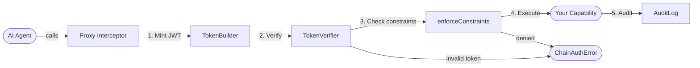

# Getting Started

**agents-chain** is a zero-dependency security layer for AI agent systems. It gives every service a **Host identity**, every agent an **Ed25519 keypair**, and gates every capability call through a signed JWT pipeline with constraint enforcement and an encrypted audit trail.

## Installation

```bash
npm install agents-chain
# or
pnpm add agents-chain
```

> Requires Node.js 18+. Ships both ESM and CommonJS builds.

## Quick Start

```typescript
import { AppChain } from 'agents-chain';

// 1. Create the chain — generates Host + Agent keypairs
const chain = await AppChain.create({
  providerName: 'billing-service',
  issuer: 'https://billing.mycompany.com',
  capabilities: [
    {
      name: 'createInvoice',
      description: 'Create a new invoice for a customer',
      inputSchema: {
        type: 'object',
        required: ['customerId', 'amount'],
        properties: {
          customerId: { type: 'string' },
          amount: { type: 'number' },
        },
      },
      outputSchema: { type: 'object' },
      execute: async (args, ctx) => {
        console.log(`Agent ${ctx.agentId} creating invoice`);
        return { invoiceId: 'inv_001', amount: args.amount };
      },
    },
  ],
});

// 2. Define grants — what the agent is allowed to do
const grants = [
  {
    capability: 'createInvoice',
    status: 'active' as const,
    constraints: {
      amount: { max: 5000 },        // can't exceed 5000
    },
    expiresAt: Date.now() + 86_400_000,  // 24h
  },
];

// 3. Wrap your service — returns a Proxy with the auth gate
const secured = chain.wrap({ createInvoice: () => {} }, grants);

// 4. Call it — the full 11-step pipeline runs before your execute function
const invoice = await secured.createInvoice({ customerId: 'c1', amount: 500 });
// ✅ works — amount is within constraints

await secured.createInvoice({ customerId: 'c1', amount: 99999 });
// ❌ throws ChainAuthError("constraint_violated") — amount exceeds max
```

## How It Works



Every method call on a wrapped service goes through:

1. **Token minting** — a fresh 60-second Ed25519-signed JWT for each call
2. **11-step verification** — signature, replay, delegation chain, grant check
3. **Constraint enforcement** — field-level argument validation
4. **Execution** — your capability's `execute` function, or delegation to the target method
5. **Audit recording** — success, denial, or error logged with auth overhead

## Delegating to Target Methods

If a capability doesn't define `execute`, the call is forwarded to the target object's own method:

```typescript
const myService = {
  async sendNotification(args) {
    return notificationApi.send(args.userId, args.message);
  },
};

const chain = await AppChain.create({
  providerName: 'notification-service',
  issuer: 'https://notify.mycompany.com',
  capabilities: [
    {
      name: 'sendNotification',
      description: 'Send a notification to a user',
      inputSchema: {
        type: 'object',
        required: ['userId', 'message'],
        properties: {
          userId: { type: 'string' },
          message: { type: 'string' },
        },
      },
      outputSchema: { type: 'object' },
      // No execute — delegates to myService.sendNotification
    },
  ],
});

const secured = chain.wrap(myService, grants);
await secured.sendNotification({ userId: 'u1', message: 'Hello' });
// → myService.sendNotification is called after auth passes
```

## Lifecycle

```typescript
// Flush audit log on shutdown
await chain.drain();

// Destroy — cleans up JTI GC timer (important in tests and Lambda)
chain.destroy();
```

## Next Steps

- [Core Concepts](/docs/concepts/host-and-agent) — understand Host, Agent, Capabilities, Grants
- [Access Requests](/docs/access-requests/overview) — human-in-the-loop approval for denied calls
- [Examples](/docs/examples/basic-service) — end-to-end Node.js examples
- [API Reference](/docs/api/appchain-config) — full config and type reference
